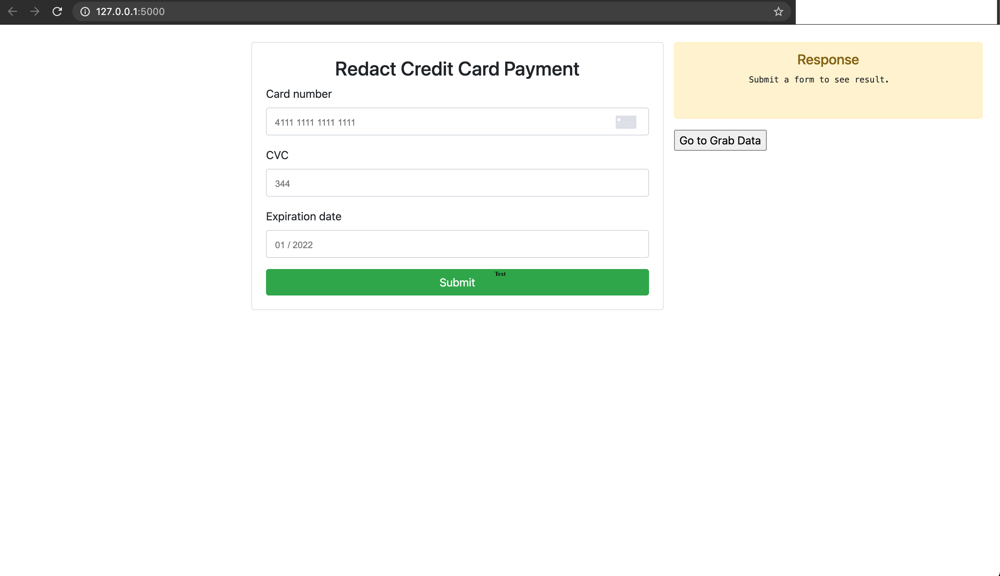
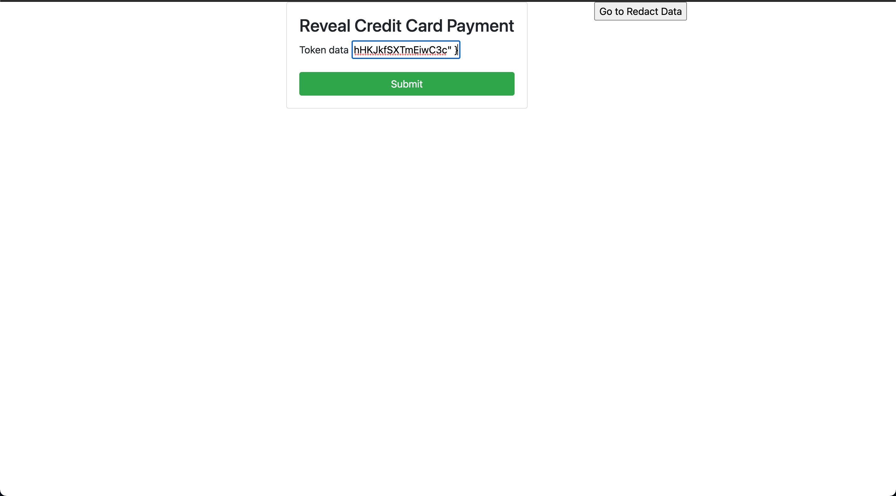

# Simple VGS Web Application 

This is a simple web application that encrypts and decrypt your credit card information. It is designed to collect, and protect your credit card information. It starts by ingesting your credit card information such as card number, card cvc and card expiration date. Then it encrypts those data to become aliased data and send to VGS vault. Furthermore, with those aliased data users can submit a request reveal the original data.
## Installation
#### Install all requirements
```
    > pip install -r requirements.txt
```
#### Start your virtual environment
```
    > source env/bin/activate
```
#### [Sign-up] an account with VGS and set up [inbound route] and [outbound route]

## How to use?

1. Update .env file
```
    USERNAME= {Your VGS Username}
    PASSWORD= {Your VGS Password}
    VAULT_ID= {Your VGS Vault ID}
    VGS_SAMPLE_ECHO_SERVER=https://echo.apps.verygood.systems
    PORT=8080
```
2. Change link below to your personal VGS Collect library link in "index.html". You can find it at VGS Collect page of [VGS Dashboard](https://dashboard.verygoodsecurity.com/)

```html
    <script src="https://js.verygoodvault.com/vgs-collect/1/<organization-id>.js"></script>
```
3. Change `<vault-id>` to your vault id to initialize your Collect form

```javascript
    const form = VGSCollect.create('<vault-id>',  function(state) {});
```
#### Run your python app
```
    > python3 myApp.py
```

#### Ther server is now running locally at `127.0.0.1:5000`

## Redact Data
1. Input your card number, card cvc and card expiration date. Then click Submit

2. After you submitted the form, you will get your aliased data.
## Reveal Data
1. Input your aliased data. Then click Submit

2. You are all set!!
## Tech & Framework
Flask <br>
VGS CollectJS <br>
VGS Account <br>
python-dotenv <br>
Requests <br>
virtualenv <br>
## Support

If you need support, start with the [troubleshooting guide],
and work your way through the process that we've outlined.

## Credits

##### [VGS Collect Credit Card Example]

##### [simple_app_test_vgs] 

[inbound route]: https://www.verygoodsecurity.com/docs/guides/inbound-connection
[outbound route]: https://www.verygoodsecurity.com/docs/guides/outbound-connection
[Sign-up]: https://www.verygoodsecurity.com/
[Not Sure]: https://www.verygoodsecurity.com/docs/overview
[VGS Collect Credit Card Example]: https://github.com/verygoodsecurity/vgs-collect-examples/tree/master/examples/credit-card-example
[troubleshooting guide]: https://www.verygoodsecurity.com/docs/faq
[simple_app_test_vgs]: https://github.com/Stepan-VGS/simple_app_test_vgs
